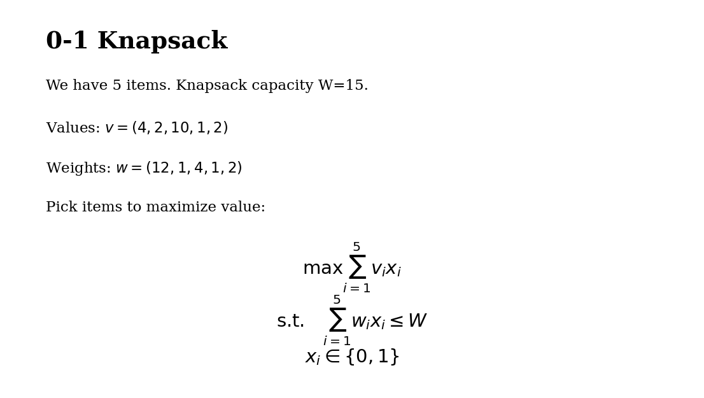

# md2mip

Compile natural-language optimization models into standalone solver CLIs.

```
markdown → (LLM) → IR → codegen → solver CLI (Python + HiGHS)
image    → (OCR) → markdown → …
```

## Examples

### 1. Quick run — data in markdown (knapsack)

`models/knapsack.md`:

> **0-1 Knapsack**
>
> We have 5 items. Knapsack capacity W=15.
>
> Values: v = (4, 2, 10, 1, 2)
>
> Weights: w = (12, 1, 4, 1, 2)
>
> Pick items to maximize value:
> max &sum; v_i x_i &ensp; s.t. &sum; w_i x_i &le; W, &ensp; x_i &in; {0, 1}

One command — the LLM extracts the data automatically:

```bash
md2mip run models/knapsack.md
```

Output:

```
Status: optimal
Objective: 15.0
Solution:
  x[item1] = 0.0
  x[item2] = 1.0
  x[item3] = 1.0
  x[item4] = 1.0
  x[item5] = 1.0
```

### 2. Compile + run with different data (transportation)

`models/transportation.md`:

> **Transportation Problem**
>
> Sources I={1,2}, destinations J={1,2,3}.
> Cost matrix c, supply s=(30, 50), demand d=(20, 25, 35).
>
> min &sum; c_ij x_ij &ensp; s.t. &sum;_j x_ij &le; s_i, &ensp; &sum;_i x_ij &ge; d_j

```bash
# Compile — generates solver script AND data template
md2mip compile models/transportation.md
```

Output:

```
Parsed: 2 sets, 3 params, 1 vars, 2 constraints
Confidence: high (no warnings)
Written: out/transportation_solver.py
Written: out/transportation_data.yaml
Run:     python out/transportation_solver.py out/transportation_data.yaml
```

Run the generated solver directly — swap in any data file:

```bash
# Run with the generated default data
python out/transportation_solver.py out/transportation_data.yaml

# Run with a larger instance
python out/transportation_solver.py data/transportation_large.yaml
```

Output:

```
Status: optimal
Objective: 215.0000
Solution:
  x[factory1,warehouse1] = 20.0000
  x[factory1,warehouse3] = 10.0000
  x[factory2,warehouse2] = 25.0000
  x[factory2,warehouse3] = 25.0000
```

`compile` always writes two files:
- `out/<name>_solver.py` — standalone solver script
- `out/<name>_data.yaml` — complete data (if model has inline data) or template to fill in

### 3. OCR — image to markdown

Got a photo of a model? OCR extracts it:



```bash
md2mip ocr docs/knapsack_photo.png -o model.md
```

Output:

```
Extracted model from docs/knapsack_photo.png
Written: model.md
Run:     md2mip compile model.md
```

## Install

```bash
pip install md2mip
```

## Configuration

```bash
cp .env.template .env
# Set your ANTHROPIC_API_KEY in .env
```

## CLI

| Command    | Description                                |
|------------|--------------------------------------------|
| `compile`  | Markdown → standalone solver CLI           |
| `run`      | Compile and immediately run with data      |
| `validate` | Compile, run, check expected objective     |
| `ocr`      | Extract a math model from an image (LLM vision) |

Run `md2mip --help` or `md2mip <command> --help` for details.

## Development

```bash
make test       # offline tests (no LLM)
make test-llm   # LLM integration tests
make lint       # ruff check
make fmt        # ruff format
make typecheck  # mypy
```

## License

MIT — see [LICENSE](LICENSE).
